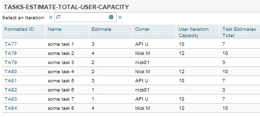

Task Estimates Total and User Capacity
=========================

## Overview
A grid of tasks by iteration that includes UserIterationCapacity data, specifically the sum of TaskEstimates and Capacity.

This app comes AS IS. It is not supported by Rally support.
## License

AppTemplate is released under the MIT license.  See the file [LICENSE](https://raw.github.com/RallyApps/AppTemplate/master/LICENSE) for the full text.
